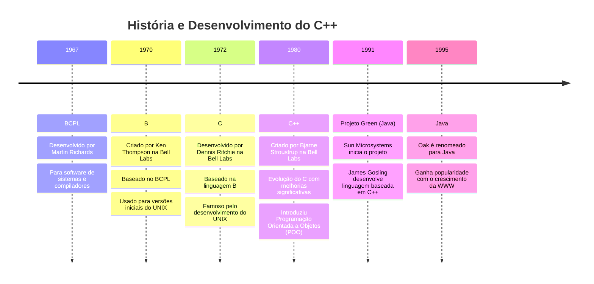

# História e Desenvolvimento do C++

## Origens e Evolução

1. **BCPL (1967)**
   - Desenvolvido por Martin Richards
   - Propósito: Escrever software de sistemas operacionais e compiladores

2. **B (1970)**
   - Desenvolvido por Ken Thompson na Bell Laboratories
   - Baseado no BCPL
   - Usado para criar versões iniciais do UNIX

3. **C (1972)**
   - Desenvolvido por Dennis Ritchie na Bell Laboratories
   - Baseado na linguagem B
   - Tornou-se famoso como linguagem de desenvolvimento do UNIX
   - Responsável pela criação de muitos sistemas operacionais e linguagens de programação

4. **C++ (início dos anos 1980)**
   - Desenvolvido por Bjarne Stroustrup na Bell Laboratories
   - Evolução do C com melhorias significativas
   - Introduziu capacidades de Programação Orientada a Objetos (POO)

## C++ Standard Library

- Coleção rica de classes e funções essenciais do C++
- Fornece componentes reutilizáveis e otimizados

## Influência no Java

- 1991: Sun Microsystems inicia o projeto Green
- James Gosling desenvolve uma linguagem baseada em C++, inicialmente chamada Oak
- 1995: Renomeada para Java devido a conflitos de marca
- Java ganha popularidade com o crescimento da World Wide Web (WWW)

## Ambiente de Desenvolvimento C++ Típico

### Componentes Principais
1. Ambiente de Desenvolvimento Integrado (IDE)
   - Exemplos: Dev C++, Code::Blocks, Visual Studio Code
2. Linguagem C++
3. C++ Standard Library

### Fases de Desenvolvimento de Programas C++
1. **Edição**: Criação do código-fonte
2. **Pré-processamento**: Preparação do código antes da compilação
3. **Compilação**: Conversão do código em linguagem de máquina
4. **Linkagem**: Vinculação do código-objeto com bibliotecas, criando o executável
5. **Carregamento**: Transferência do executável para a memória
6. **Execução**: Processamento do programa pela CPU

